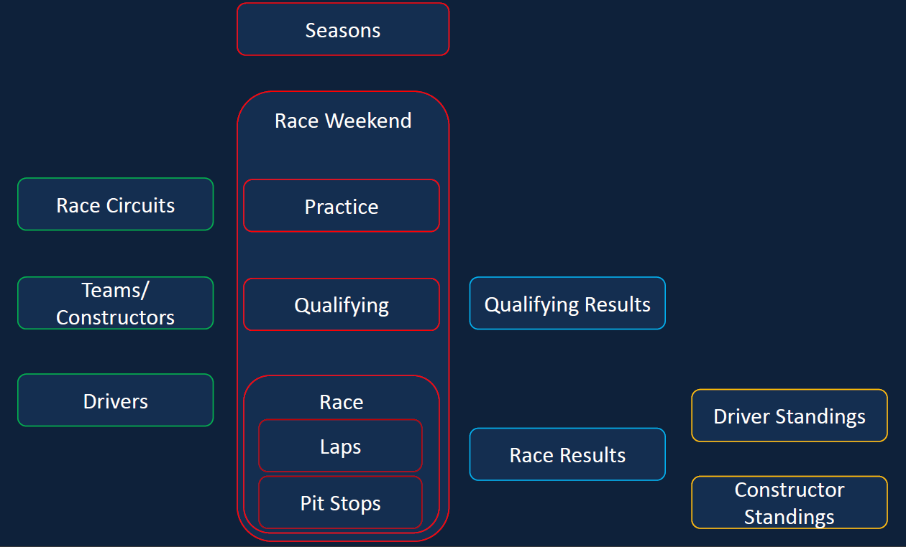
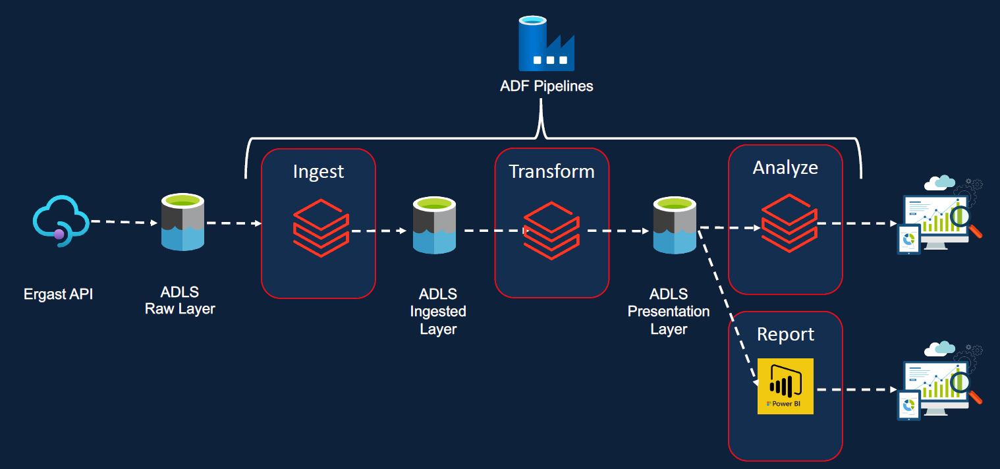

# Databricks Formula 1 Racing Analysis

## Problem Statement
To design and orchestrate a Data Pipeline using Databricks and Azure to perform analysis and visualization on Formula 1 race results.

### Formula 1 Overview
An Overview of Formula 1 racing can be learned from https://f1chronicle.com/a-beginners-guide-to-formula-1/

## Project Requirements
### Data Ingestion Requirements:
- Ingest All 8 files into the data lake.
- Ingested data must have audit columns.
- Ingested data must be stored in columnar format (i.e., Parquet).
- Ingested data must have the schema applied.
- Must be able to analyze the ingested data via SQL.
- Ingestion logic must be able to handle incremental load (Results, PitStopes, LapTimes, Qualifying).

### Data Transformation Requirements:
- Join the key information required for reporting to create a new table.
- Transformed tables must have audit columns.
- Transformed data must be stored in columnar format (i.e., Parquet).
- Must be able to analyze the transformed data via SQL.
- Transformation logic must be able to handle incremental load.

### Reporting Requirements:
- Drivers Standings.
- Constructors Standings.
  
### Analysis Requirements:
- Dominant Drivers.
- Dominant Teams.
- Visualize the outputs.
- Create Databricks Dashboards. 

### Scheduling Requirements:
- Scheduled to run every Sunday 10PM.
- Scheduling Requirements.
- Ability to monitor pipelines.
- Ability to re-run failed pipelines.
- Ability to set-up alerts on failures.

### Other Non-Functional Requirements:
- Ability to delete individual records.
- Other Non-Functional Requirements.
- Ability to see history and time travel.
- Ability to roll back to a previous version.

## Data Source
The data for all the Formula 1 races from 1950s onwards is ontained from an open source API called Ergest Developer API (http://ergast.com/mrd/). The API provides the following tables:  

Attributes of each tables is described in http://ergast.com/docs/f1db_user_guide.txt. Each tables is present as a single line/multiline CSV or JSON file in the data folder. 

## Data Pipeline

The data from Ergest Developer API is imported into raw ADLS container on Azure. We will then take this data and process using databricks notebook to ingest into ingested raw layer. The data in this layer will have schema applied as as well stored in the columnar parquet format. We will create partitions wherever applicable as well as add additional information for audit purposes, such as a date, a source of the data, etc. Ingested data will then be tranformed via databricks notebook for presentation layer where dashboards are created to statisfy our requirements for analysis. Azure Data Factory is later used for scheduling and monitoring requirements. This pipeline is later converted into Delta Lakehouse architecture to satisfy other requirements around GDPR, time travel, etc.

## Project Structure
1. ingestions - contains notebooks to process and ingest all the data files from raw layer to ingested layer. Handles the incremental data for files results, pitstopes, laptimes and qualifying.
2. trans - contains notebooks to transform the data from ingested layer to presentation layer. Notebook perfroms transformations to setup for analysis.
3. set-up - notebooks to mount ADLS storages (raw, ingested, presentaton) in databricks.
4. includes - includes notebooks containing helper functions used in transformations.
5. analysis - contains SQL files for finding the dominant drivers and teams and to prepare the results for visualization.
6. raw - contains SQL file to create ingested tables using Spark SQL.
7. utils - contains SQL file to drop all databases for incremental load.
8. data - contains sample raw data from ergast api.

## Technologies Used:
- Datadricks
- PySpark
- Python
- Power BI (Visualizations)
- Azure Databricks
- Azure Data lake gen2
- Azure Data Factory (Pipeline Scheduling)
- Azure key- Vault
